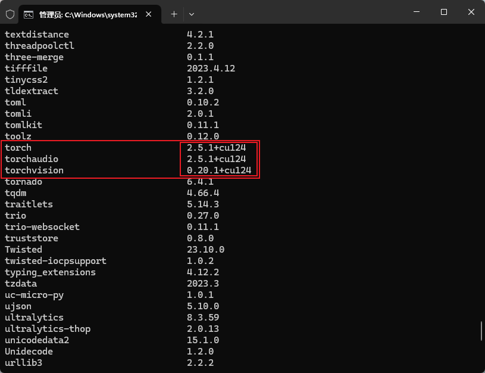

## 1. 系统环境需求

1. 安装Anaconda，添加到环境变量
2. 安装Python
3. 安装Torch
4. 如果使用N卡，请安装好CUDA Toolkit和cuDNN

检查系统环境：
```cmd
conda --version
python --version
nvcc --version
```

Python下检查系统环境：
```python
import torch
print(torch.__version__)
print(torch.version.cuda)
```

如果使用N卡，确定适合自己版本的CUDA，使用以下命令检查合适版本：

```cmd
nvidia -smi
```

CUDA及Torch配置请参考以下教程：
[CUDA配置及Pytorch-gpu安装教程_cuda12.5对应的pytorch版本-CSDN博客](https://blog.csdn.net/qq_56079620/article/details/139363718)

检查cuda在当前python环境下是否可用，true代表可用，如果为false请检查安装的版本是否与显卡对应且支持。

```
import torch
torch.cuda.is_available()
```


> [!important]
> 我的系统环境如下：
> - conda 24.7.1
> - Python 3.12.4
> - torch：2.5.1+cu124
> - cuda：12.4

>[!tip]
>cmd中运行`pip list`检查troch、torchaudio、torchvision的版本是否一致
>
>如果不一致可以单独卸载其中一个，重新运行安装命令，例如：
>```
>pip3 install torch torchvision torchaudio --index-url https://download.pytorch.org/whl/cu124
>```
>以上命令可以在[PyTorch](https://pytorch.org/)官网找到所需要的对应版本。

## 2. 安装YOLOV8环境

1. 安装YOLOV8
```cmd
pip install ultralytics --upgrade -i https://pypi.tuna.tsinghua.edu.cn/simple
```
2. 验证安装
```python
import ultralytics
ultralytics.checks()
```
3. 安装第三方工具包
```cmd
pip install numpy opencv-python pillow pandas matplotlib seaborn tqdm wandb seedir emoji -i https://pypi.tuna.tsinghua.edu.cn/simple
```


## 3. 官方预训练模型

- 官方github仓库：[ultralytics/ultralytics: Ultralytics YOLO11 🚀](https://github.com/ultralytics/ultralytics)

### （1）命令行使用，以11x模型为例：
```cmd
yolo pose predict model=yolo11x-pose.pt source=image/run.jpg device=0
```

- `yolo`：这是命令的前缀，表示正在使用YOLO系列工具。
- `pose`：这指定了要执行的任务类型，即姿态估计。
- `predict`：这是命令的动作，表示要使用模型进行预测。
- `model=yolo11x-pose.pt`：这个参数指定了用于预测的模型文件。在这里，`yolo11x-pose.pt` 是模型文件的名称，它应该是已经训练好的YOLOv11姿态估计模型。
- `source=image/run.jpg`：这个参数指定了输入源。在这个例子中，`image/run.jpg` 是要进行分析的图片文件。YOLOv11也可以处理视频文件或摄像头输入，例如设置为`0`，表示调用设备已有摄像头输入。
- `device=0`：这个参数指定了用于执行预测的设备。在这里，`0` 通常表示使用第一个可用的GPU。如果设置为 `cpu`，则表示使用CPU。如果系统中有多个GPU，可以通过更改数字来指定其他GPU。

