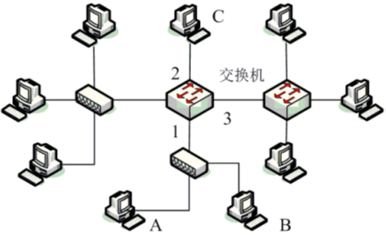
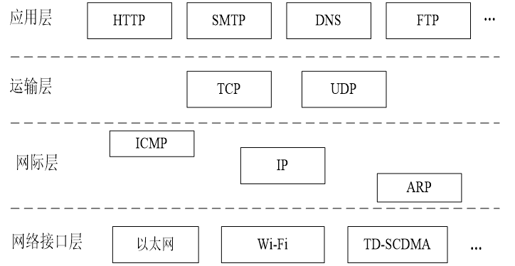
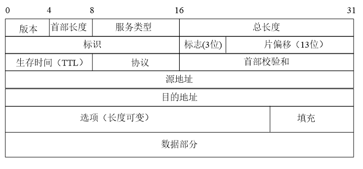
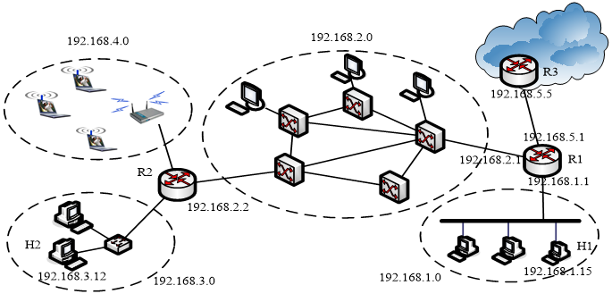
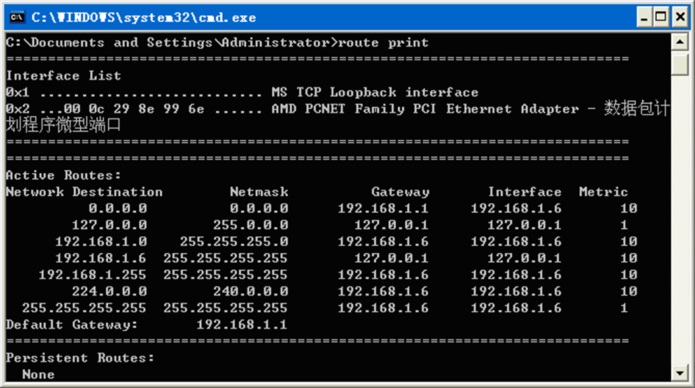
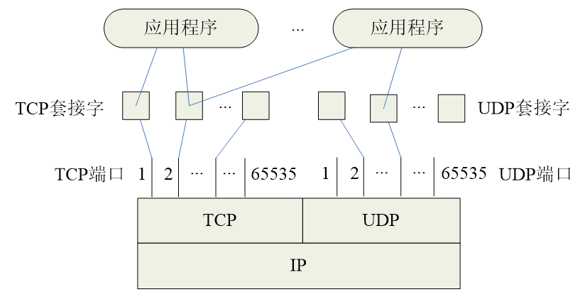

## 计算机网络的基本概念

计算机网络由一组通过通信设备和线路连接起来的独立计算机组成，其目标是为不同计算机上运行的应用程序之间提供通信服务。

- 网络中的计算机分为两类，一类运行应用程序，称为主机，这些运行在主机上的应用程序才是网络的真正“用户”。
- 另一类计算机专门负责转发数据，这类计算机中最典型的代表是以太网交换机和路由器。

### 网络分类

- 计算机网络的分类方式有多种，最常见的一种是按照网络覆盖的地域范围的大小分类，分为:

	- 广域网（Wide Area Network，WAN）

	- 城域网（Metropolitan Area Network，MAN）

	- 局域网（Local Area Network，LAN）等

- 另一种常见的网络分类方式就是按照连接计算机的通信介质分类，可分为

	- 无线网络

	- 有线网络

	- 不管是有线介质还是无线介质，均是为计算机之间的信息传递提供的通道，即信道。

### 分组概念

- 网络上传输的数据是以分组（packet）为单位的，分组实际就是一个由二进制字节构成的序列。

- 分组中最重要的部分是用户数据，用户数据就是实际要传输的数据；

- 除了用户数据，分组中还包括一些为了能正确传输分组而提供给网络使用的控制信息。

	- 控制信息一般被按固定的结构组织在一起，并添加在用户数据的前面同数据一起传输，通常被称为分组首部。

- 分组首部的组织结构再加上其后的数据部分就是所谓的分组结构（也称分组格式）。

### 网络协议

- 网络协议是指通信双方在通信时所必须遵循的规则、标准和约定。它规定了有关功能部件在通信过程中的操作，定义了数据发送和数据接收的过程。

- 一个网络协议包括三方面内容

	- “语法”，主要是指数据以及控制信息的结构或格式，即分组结构，但在网络最低层的与物理线路和信号有关的协议中，语法是指数据编码、信号电平等；

	- “语义”，是指对构成协议的各元素的含义的具体解释；

	- “同步”，也称为“时序”，它规定了通信过程中各种操作及事件的先后顺序。

### 点到点信道广播信道

- 根据计算机与信道的连接方式，可把信道分成两种，一种只能在一条信道的两端连接计算机或通信设备，即点到点信道；另一种则可以在一条信道上连接多台计算机或设备，称为广播信道。

	- 在由点到点信道组成的计算机网络中，除了联网的计算机和信道以外，还有一种被称为交换机的设备，用于在多条信道之间转发数据。

	- 一台交换机通常有很多个网络接口，每个接口可连接一条点到点信道的一端。由交换机组成的通信网络被称为交换网络。

- 在由广播信道组成的网络中，多台计算机被连接到同一条信道上，但由于信道上同时只能传送一台计算机发送的信号，因此当有两台或两台以上的计算机都要发送信息时就会出现冲突。

- 为了避免冲突，需要使用复杂的控制机制来决定网络中的哪台计算机可以向信道中发送数据，这种控制机制被称为信道的多点访问协议（Multiple Access Protocol，MAP）。

- 广播信道通常使用在覆盖范围较小的局域网中。使用广播信道的典型例子是早期的采用总线结构组网的以太网，以及现在常见的Wi-Fi无线网络。
## 典型的计算机网络——以太网

- 以太网是美国施乐（ Xerox ）公司1975年研制成功的世界上第一种局域网技术。IEEE的802委员会于1983年制定了第一个IEEE的以太网标准，其编号为802.3。

- 除了以太网技术外，20世纪80年代还相继出现了其他一些局域网技术，比较典型的包括令牌总线（Token Bus）网和令牌环（Token Ring）网等，只不过这些局域网技术在激烈的市场竞争中早已被淘汰，只有以太网技术目前仍被广泛应用。

- 信道访问协议
	- 最早出现的以太网是总线型以太网。多台计算机通过一条总线连接起来，任何两台计算机的通信都要通过这条总线进行。当总线上的两个或两个以上的节点同时发送数据时，用以表示数据的信号就会在链路上互相叠加，使接收端无法正确识别，产生数据碰撞。

	- 一旦发生碰撞，发送者必须要重新发送发生碰撞的数据，如果碰撞频繁发生，将会大大降低网络的性能。

	- 广播信道上的数据碰撞是无法完全避免的，但可以采用精确设计的多点访问控制协议减少数据碰撞发生的概率。以太网中的多点访问控制机制是带碰撞检测的载波侦听多路访问（CSMA/CD）协议。

- 为了区分网络上的不同计算机，通常是事先为每台计算机分配一个由若干二进制位组成的编号，该编号就是物理地址或MAC地址，有时也称硬件地址。

	- 以太网的MAC地址是一个48位（6字节）的无符号二进制数，书写的时候通常用16进制表示。

	- 具体地说，MAC地址是分配给计算机上的网络接口卡（简称网卡）的，固化在网卡的ROM中，48位全为1的MAC地址是广播地址，不会被分配给任何网卡。

	- 如果计算机上如果安装有多个以太网卡，则这台计算机就会有多个MAC地址，一般情况下，同一台计算机上的不同网卡会连入不同的网络。

### 以太网的MAC地址

- 为了区分网络上的不同计算机，通常是事先为每台计算机分配一个由若干二进制位组成的编号，该编号就是物理地址或MAC地址，有时也称硬件地址。

	- 以太网的MAC地址是一个48位（6字节）的无符号二进制数，书写的时候通常用16进制表示。

	- 具体地说，MAC地址是分配给计算机上的网络接口卡（简称网卡）的，固化在网卡的ROM中，48位全为1的MAC地址是广播地址，不会被分配给任何网卡。

	- 如果计算机上如果安装有多个以太网卡，则这台计算机就会有多个MAC地址，一般情况下，同一台计算机上的不同网卡会连入不同的网络。

### 以太网的帧结构

帧实际就是在物理信道上传输的数据分组的另一种叫法。帧的组成部分被称为字段，各字段的排列位置是固定的，除数据字段外，各字段长度通常也是固定不变的。

以太网帧结构如下：

| 6B   | 6B  | 2B  | 46~1500B | 4B  |
| ---- | --- | --- | -------- | --- |
| 目的地址 | 源地址 | 类型  | 数据字段     | 校验码 |
- 目的地址：指明要接收该帧的计算机的MAC地址。如果是一个广播帧，即该帧是广播给网络中的所有计算机的，目的地址应指明为广播地址。

- 源地址字段：指明发送该帧的主机的MAC地址，通过该字段，收到该帧的主机就会知道是哪台机器发送了该帧。

- 类型字段：指明接收方对帧中数据的处理方式，也就是说，接收端收到数据后，帧中的数据应该交给哪个程序处理，例如，当类型字段的值为0x0800时表示数据字段的内容为一个IP分组，应该交给操作系统的IP模块处理。

- 数据字段：也称用户数据，这部分二进制数据就是网络真正要传送的内容，至于这些二进制数据的含义和用处，跟计算机网络是无关的。其长度在46字节到1500字节之间

- 校验码：是提供给接收方用来检查数据在传输过程中是否出错的，它由发送方根据帧的其它部分的内容使用某种算法计算得到，接收方收到帧后用相同的算法对相同部分的数据再计算一遍，得到的结果如果跟校验码相同，则说明传输中数据没出错。

- 校验码的计算方法由于篇幅所限，就不再进一步解释了。

### 广播与单播

- 以太网中的计算机可以同时向其它所有的计算机发送数据，也可以选择向其中的某一台计算机发送数据，前者称为广播，后者称为单播。

- 广播是通过引入一个被称为“广播地址”的特殊地址来实现的。

	- 规定48位全为1的MAC地址为广播地址，它不能被分配给任何主机，因此它只能作为目的地址出现在帧中，而不能作为源地址使用。

	- 目的地址是广播地址的帧被称为“广播帧”。目的地址是某块网卡的MAC地址的帧则被称为“单播帧”。

- 由于以太网使用的是广播信道，因此任意一台计算机发出的帧，其它所有的计算机都能收到，但是，计算机的网卡通常只接收发给自己的帧和广播帧。

- 收到一个帧后，网卡通过帧中的目的地址来判断该帧是不是发给自己的：

	- 如果目的地址跟自己的MAC地址相同，则该帧是发给自己的，收下；

	- 如果目的地址是广播地址，说明该帧是广播帧，也要收下，其他情况则丢弃。

### 以太网的拓扑结构

- 拓扑学是几何学的一个分支；拓扑学首先把实体抽象成与其大小、形状无关的点，将连接实体的线路抽象成线，进而研究点、线、面之间的关系。网络拓扑就是指网络中的结点（通信设备或计算机）和通信线路相互之间的连接关系。

- 以太网最初的拓扑结构是使用粗同轴电缆的总线结构，后来粗同轴电缆被较为便宜的细同轴电缆所替代。

- 后来又发展出使用更为便宜的双绞线和集线器组成网星形拓扑结构的以太网络。如图所示，星型结构中各计算机通过双绞线连接到作为中心的集线器上。

### 集线器

- 集线器使用大规模集成电路来模拟同轴电缆的工作，因此这种星型以太网在逻辑上仍然是一个共享信道的“总线网络”，只不过“总线”被“缩短”并装进了盒子。

- 星型结构的以太网比使用同轴电缆的以太网络可靠性要高得多，并且价格便宜、连接简单，因此总线型以太网早已被双绞线组成的星形以太网所取代。

- 目前集线器也已逐渐被性能更好的以太网交换机所取代。

### 以太网交换机

- 交换机在样子上虽然与集线器相似，但其工作原理却大不相同。

- 以太网交换机是一种有多个以太网接口的存储转发设备，不再像集线器那样模拟总线的工作。

	- 存储转发，是指在接收数据时交换机先将收到的数据存储在自己的存储器中，待一个帧完全接收完成后，再根据其目的地址把它从相应的网络接口转发出去。

- 交换机的每个网络接口都连接到一根不同的广播链路，由于位于不同端口的链路上的计算机不再共享同一信道，因此大大减小了碰撞机会，从而提高了数据传输率。

- 交换机可以将多台计算机直接连接成一个以太网，也可以连接多个由集线器或交换机组成的以太网以形成更大的一个以太网。

### 以太网交换机的工作原理

- 首先，在交换机内部维持着一张转发表，用于记录可以到达某计算机的网络接口。该表结构如图所示。表中的三个表项分别表示MAC地址为A的主机连接在端口1上，MAC地址为B的主机连接在端口2上，MAC地址为C的主机也连接在端口1上。

| MAC地址 | 网络接口 |
| ----- | ---- |
| A     | 1    |
| B     | 2    |
| C     | 1    |

- 当交换机从某个接口收到一个帧后，分析包中的目的MAC地址，并通过查找转发表确定该数据包应转发到哪个接口；如果在表中查不到目的地址对应的端口，则向所有端口转发（除收到帧的端口外）该帧。

- 转发表是通过逆向学习算法创建并维护的。

- 交换机每收到一个帧都会把帧首部中的源地址取出，并检查转发表中是否已登记了该地址，如果未登记，则将该地址以及帧进入交换机的端口（对应网络接口）作为一个表项添加到转发表中；如果表中已经存在该地址，则用该帧入交换机的端口更新原先的网络接口。

- 逆向学习算法是基于这样一个事实：从计算机A发出的帧如果从交换机的端口x进入到交换机，那么从这个端口出发沿相反的方向一定可把一个帧传送到计算机A。

- 除以太网外，还有许多种基于不同技术的局域网，比如已经不再使用的令牌环网和令牌总线网，还有现在越来越流行的无线局域网（WIFI）等。

## 广域网与分组交换技术

- 广域网是用来实现计算机间的长距离数据通信的。

	- 网络上的计算机可能分布在相距几百公里甚至是几千公里的不同城市里。

	- 铺设长距离的通信线路成本是昂贵的，因此，最初人们在实现两台距离遥远的计算机间的通信时通常是借用已经存在的通信网络——电话网来传输计算机的数据。

- 调制解调器

	- 电话网是用于传送音频信号（是模拟信号）的，但计算机信号是数字信号，不能直接在电话网中传递的。

	- 发送端需要先将要发送的数字信号转换成模拟信号后再发送到电话线上，接收端则需要将电话线上传来的模拟信号恢复成原来的数字信号再交给目的计算机。

	- 将数字信号转换成模拟信号的设备称为调制器，将模拟信号恢复为数字信号的设备称为解调器。由于计算机间的通信通常都是即发也收，因此调制器和解调器被集成到一个设备中，叫做调制解调器（Modem），俗称“猫”。

- 使用电话网传递计算机数据有两个明显的缺点

	- 任何想通信的两台计算机在通信之前都需要先有一条电话线连接，这条连接一旦建立，其他的计算机就不能再用，即使是在没有数据传输的时候，造成资源浪费；

	- 使用电话线传输数字数据的速率（也就是带宽）太低。

- 为了克服这些缺点，人们逐渐发展起了一系列的广域网技术，先后出现的典型技术包括X.25、帧中继、ATM（异步传递方式）等。

	- 这些技术的性能指标以及设备造价相差很大，但它们最基本的原理却是相同的，都是基于分组交换技术的。

### 电路交换

- 交换的概念来源于电话网。当两部电话通话时只要用一对电话线将它们连起来就可以，但当多部电话之间需要相互通话时，每两部电话之间都连一对线显然是不可行的。

- 解决的办法是在城市中央修一个电话中心，每部电话到电话中心拉一条电话线，电话中心派一个接线员，通电话时接线员将要通话的电话接到一块；通完话再断开。

- 多个城市之间的电话要通话时，则可以建立一个更高级别的电话中心，每个城市的交换中心都连一条或多条电话线到这个更高级别中心，由该中心负责城际电话的交换。以此类推，就形成了电话网。

- 这是“交换（switch）”的本来含义，可以理解为“转接”——把一条电话线转接到另一条电话线。从通信资源的分配角度来看，“交换”就是按照某种方式动态地分配传输线路的资源。

- 1889年一种可以替代接线员的机器被发明出来，这种机器可以根据你所拨的电话号码自动将你的电话与你所拨的电话连接起来，这种机器就是“自动电话交换机”。

- 这种使用自动电话交换机通过拨号给通信双方直接建立一条物理通信线路的交换方式就是所谓的电路交换。

- 电路交换的工作过程分为三个阶段：

	- 第一阶段是建立连接，通话发起方拨号，交换机根据所拨号码选择要连接的线路，建立起一条物理线路连接；

	- 第二阶段就是利用建立的线路通话；

	- 第三个阶段称为释放连接，通话完成后通过挂断电话，通知交换机释放所占用的线路。

### 计算机广域网

- 类似于电话网，在规模较大的广域网中，也需要组建一个由通信线路和交换机构成的通信网络。

- 类似于每部电话机都有一个互不相同的电话号码一样，分组交换网络中的每台计算机也必须有一个互不相同的地址，用于区分网络中不同的计算机，同以太网的MAC地址一样，这个地址被称为计算机的硬件地址。

### 计算机网络中的数据突发性

- 计算机通信时，常常突然在短时间内有大量的数据需要传送，然后又长时间没数据传输。这种特点被称为数据传输的突发性。

- 数据的突发性使得计算机网络采用电路交换技术并不合适。

	- 如果使用电路交换，则需要在通信的两台计算机间通过拨号建立一条物理连接，连接一旦建立，其所用到的线路资源就会被该通信所独占，别人无法使用，尽管很多时间是空闲的，从而造成很大的资源浪费。

### 分组交换

- 计算机网络通常采用分组交换技术。

- 分组交换技术与电路交换技术有很大不同，在通信时通常并不需要建立连接和释放连接，也不能向电路交换那样可以连续地传送任意长的数据。

- 计算机在发送数据时，通常需要先把过长的原始数据划分成若干个较小的数据块，再在每个数据块前加上由目的地址以及其他控制信息构成的首部形成一个个数据分组，然后依次将它们发送给与计算机直接相连的交换机。

- 交换机在收到一个分组后先予以存储，再按分组首部的地址信息查找事先建好的转发表，根据表中指明的接口转发给下一台交换机，下一台交换机也进行同样的处理，一直到转发给目的计算机为止。

- 交换机的这种转发方式被称为存储转发，用这样的存储转发方式，最后分组就能到达最终目的地。

- 目的计算机在收到所有分组后，再把各分组的首部去掉，将各分组中的数据块装配成原来的数据。

### 分组交换的缺点

- 交换机收到分组后需要进行分析目的地址、查找转发表、转发等处理，这些处理需要花费时间，如果分组到达的速度快于其处理速度，后到的分组就需要在交换机内部进行排队等待，为此，交换机内部需要有较大的缓存空间用于缓存多个排队的分组。

- 另外，分组在交换机内部排队等候会造成数据传输产生较大的时延，更严重的时，如果需要排队的分组过多而导致交换机内的缓存空间用尽的话还会造成分组的丢失。

- X.25、帧中继等广域网技术都是基于分组交换的，以太网交换机其实也是一种分组交换技术。

- 不同的分组交换技术之间的差别主要在于交换机转发表的构造以及维护算法不同、分组的转发策略不同、接口连接的信号传输介质不同等，当然也有随之带来的性能、造价方面的不同。

## 网络互联

- 所谓网络的互联是指将两个或两个以上的计算机网络，通过一定的方法，用一种或多种通信处理设备相互连接起来，构成更大的网络系统，以使位于不同网络中的计算机也能相互通信和实现资源共享。

- 网络互联的形式有局域网与局域网，局域网与广域网，广域网与广域网的互联三种。

- 网络互联是计算机网络出现后随之而来的一种很自然的想法，但是，这个想法的实现却并不容易，原因是不同的网络由于采用的技术不同而差异太大，比如，硬件地址的编址方案、帧的结构、传输介质、管理与控制方式等等。

- 采用同种技术的网络互联通常要简单一些

	- 由交换机构成的两个以太网互联，通常只要分别在两个网络中各选一台交换机，再从这两台交换机上各自选择一个端口，将这两个端口用网线直接相连就可以了。这时两个以太网就连成了一个规模较大的以太网，从而实现了原来两个网络中的计算机实现互联互通的目的。

	- 从以太网交换机的工作原理可知，网中的任何一台计算机发送一个广播信息，网中所有的计算机都能收到，这时一般称这些计算机在同一个广播域中。

	- 显然，两个以太网直接相连就是将两个较小的广播域合并成了一个大的广播域，但是，当一个广播域过大时，由于网络产生的广播包过多网络性能会有很大下降甚至不能工作。

### 异种网络互联

- 较早的一种可以连接不同类型网络的设备是网桥(bridge)，网桥主要用来连接两个局域网，但网桥不是一种通用的网络到网络的连接设备。

- 两种不同种类的局域网相连，要用专门为这两种局域网相连而设计的网桥，比如一个以太网要与一个令牌环网相连，则需要用到专门设计的以太网到令牌环网的网桥，用于连接两个以太网的网桥，只能连接两个以太网，而不能用于连接其他类型的网络。

- 目前已很少使用网桥来连接两个网络，但是网桥也并非完全被淘汰了，前面所介绍的以太网交换机其实就是多端口的以太网到以太网的网桥，之所以不在叫网桥了，主要是因为网桥的端口较少，通常只有两个，而交换机则端口众多，常见的有8口、24口、48口等。

- 现在实现网络互联所使用的是一种被称为路由器（router）的设备，路由器也是一种分组交换设备，它实际上是一种具有多个网络接口的专用计算机，用来在多个网络之间转发数据分组。目前，路由器是实现网络互连的核心设备

- 仅仅靠路由器仍然是不能实现网络互联互通的，还必须在所有计算机上安装并运行一套被称为TCP/IP协议的网络通信软件才行。这套软件的核心是IP协议（Internet Protocol），即互联网协议。

- IP协议是不同网络中的计算机能够相互通信的关键，不仅仅是所有网络中的计算机，路由器上也都安装并运行着IP协议。

## 计算机网络体系结构

- 和建造计算机网络是一件很复杂的事情。将复杂的问题分设计解成若干个相对简单的子问题分别处理是人们在解决复杂问题是常用的手段。

- 为了便于设计和实现计算机网络，人们将整个计算机网络系统按照功能划分成多个不同的模块，各模块之间即相互独立又相互配合共同实现网络应用相互通信的目的。

- 计算机网络的各功能模块通常是按“层次结构”来划分的。

### 网络体系结构的层次模型

- 在这种层次结构中，每层都完成独立的功能。每层得功能都需要借助其下一层的功能才能实现，同时，自身的功能要能被上一层使用。

- 本层的功能被上一层所使用通常称为本层为上一层提供服务。服务与被服务只能发生在相邻的层次之间，不能跨层进行。

- 这种计算机网络的层次结构以及各层功能的定义就是所谓的网络体系结构。

- 目前，实际应用中的最典型的网络体系结构是因特网的基于TCP/IP协议族的网络体系结构。

- 在网络体系结构的层次模型中，各层为其上层所提供的服务是通过向其上一层提供的一组操作命令（也可理解为函数调用）来实现的，这些操作命令被称为服务原语，它定义了该层可为其上层执行哪些操作完成哪些功能，但并不涉及如何来实现这些操作和功能。

- 给出如何实现这些操作和功能的具体方法和步骤的是协议，但体系结构中并不要求某一层必须采用什么协议。

- 具体的网络中，各层所采用的协议可以自由改变，但各层所提供的服务是不能改变的，只有这样，当某层因技术进步而改变时（比如，用能够完成相同功能但更高效的新协议替换原来的老协议），才不会影响到其他各层。

- 概括来说，在网络体系结构的分层模型中，每层都完成独立的功能。

- 每层功能的实现都需要借助下层的服务来完成，同时本层还要向上层提供更高级的服务。

- 各层的功能是由各层的协议控制完成的，网络的层次结构一旦确定，各层的功能也就随之确定了，但各层所使用的协议则可以采用不同的版本。

- 各层所用到的所有协议所组成的集合称为协议族，有时也将协议族称为协议栈，那是因为各层次的协议按层次画在一起很像数据结构中的栈。

### ISO的OSI/RM模型

- 国际标准化组织ISO发布的计算机网络体系结构的标准模型，被称为OSI/RM（Open System Interconnection/Recommended Model）模型，即开放系统互连参考模型，通常又称为X.200建议。

- OSI/RM模型将计算机网络按功能分为七个层次，从下到上依次为物理层、数据链路层、网络层、传输层、会话层、表示层和应用层。

#### 物理层

- 计算机网络的设计建造中，首先要解决的一个问题是相邻的两个节点间的通信问题，也就是采用何种通信技术将两台计算机直接连接起来，以使两台计算机间能相互发送二进制比特流。

- 因此，物理层所关注的主要是关于连接计算机的信道的问题，主要涉及采用何种传输介质（双绞线、光纤还是无线电）、发送端如何将要发送的二进制比特序列转化为能够在传输介质上传输的电信号、接收点又如何识别电信号并将其恢复成原来的比特序列、通信介质与节点的物理连接接口的大小、形状以及固定方式、信号线的排列顺序等等。

- 物理层的主要功能是，利用通信介质为需要直接通信的的节点之间建立、维护和释放物理连接，实现二进制比特流的传输，进而为其上的数据链路层提供二进制比特数据的传输服务。

#### 数据链路层

- 物理层提供的通信信道（物理连接）能够在两台计算机之间传送二进制比特流，但是信道在传输比特流的过程中是不能保证不发生错误的。

	- 例如，某个表示“1”的电信号在传输过程中由于受到外部噪声的干扰发生了较大的变化，被接收端错误地识别成了“0”，当然也有可能“0”被识别成“1”的情况，类似的情况在普通的有线传输中虽然概率很低，但是不可避免，在无线通信中发生的概率就比较高了，

- 因此必须采用某种机制对要传输的数据进行差错控制——检查是否出错以及出错后的错误修正。

- 另一个问题是：由于网络节点性能的差异，接收端从链路上接收并处理数据的速度有可能比发送端发送数据的速度要慢，这样接收端就会因来不及处理到达的数据而造成数据丢失，所以收发端必须采取某种机制来协调两端的收发两端的速度，这就是所谓的流量控制。

- 为了便于实现差错控制和流量控制，数据链路层以“帧”（frame）为单位进行数据传输，帧的格式、差错控制和流量控制的方法等，都是由链路通信协议规定的。

- 物理线路连同实现链路通信协议的硬件和软件一起被称为数据链路（Data Link）。

- 数据链路层的主要功能就是在物理层提供的比特流传输服务基础上，以帧为单位，在有差错的物理线路上，实现无差错数据传输，简单一点说就是在数据链路两端实现无差错数据传输。

#### 网络层

- 物理层和数据链路层实现的是相邻节点之间的数据传输，如何在链路层提供的服务基础之上，通过中间节点的数据转发在分组级交换网络上实现任意两台计算机间的通信，则是网络层的功能。

- 网络层以“分组”（packet）为单位，通过适当的路由选择，可以为网络上的任意两台计算机之间提供通信服务，并能实现拥塞控制和网络互联等功能。

- 从数据通信服务的可靠性角度考虑，网络层的设计有两种：

	- 一是面向连接的可靠服务，这种可靠服务需要通信两端在通信前先要建立“虚电路”。

	- 二是尽最大努力交付的数据报服务，这种服务在通信前不需要任何操作，只要将分组发送到网络上，由网络根据分组中的目的地址尽其最大努力将分组转发给目的计算机，但不保证传输过程中分组不会丢失。

- IP采用的是不可靠的数据报服务。

#### 传输层

- 网络进程的概念：能够利用计算机网络与其它计算机上正在运行程序进行通信的程序通常被称为网络程序。正在运行中的网络程序称为网络进程。

	- 进程是操作系统的核心概念之一，是指程序在一个数据集合上的运行过程，是操作系统进行资源分配和调度的一个独立单位。通俗一点说，进程就是程序在计算机上的一次执行活动，当你启动了一个程序，你就启动了一个进程，退出一个程序，也就结束了一个进程。

- 前面我们不止一次提到的“计算机与计算机之间的通信”实质上是计算机上运行的进程之间的通信。

- 一台计算机上通常都会同时运行多个应用程序，也就是有多个应用进程在运行，当网络层协议收到一个数据分组时，它应该将将其交给那个应用进程？

	- 网络层不具备区分不同应用进程的能力。网络层应将分组中的数据取出交给传输层，由传输层决定将数据交给哪个应用进程。

- 传输层直接为应用进程提供通信服务，这种“应用进程到应用进程”的数据传输服务，通常被称为端到端（end-to-end）通信服务。

- 传输层为多个应用进程共用网络通信服务提供了支撑。除此之外，还可以在网络层提供的不可靠的数据报服务之上，通过采用可靠传输协议为应用进程提供可靠的通信服务。

#### 会话层

- 组织两个会话进程之间的通信，管理数据的交换

#### 表示层

- 用于处理两个通信系统中交换信息的表示方式，包括数据格式交换、数据加密与解密、数据压缩与恢复等。

#### 应用层

- 应用层主要任务是利用网络通信功能来实现特定的应用功能，该层定义应用的总体框架以及进程间通信和交互的具体规则。

- 不同的网络应用需要有不同的应用层协议。比如目前因特网上的万维网（WWW）是最典型的一个网络应用，它所使用的应用层协议为超文本传输协议HTTP，而另一个典型应用电子邮件对应的协议则是SMTP协议。

- 应用进程间传输的数据被称为报文（message）。

### TCP/IP体系结构模型

- TCP/IP体系结构只有四层，从上到下分别是应用层(Application layer) 、传输层(Transport layer)、互连层(Internet layer)、主机至网络层(Host-to-Network layer) 。

### TCP/IP协议族中网络被分为四个层次

- 第一层为网络接口层（Host-to-Network layer），它主要由基础的物理通信信道构成，如以太网或调制解调器拨号连接，通过这些物理信道直接相连的计算机可以不经过路由器而直接通信。

	- TCP/IP对这一层没有任何要求，它可以是任何一种物理信道。

- 第二层是互联网层(Internet layer)，该层对应的协议是IP协议，它所解决的问题是使网络上的任意两台主机之间能够传送分组，也就是在任意两台主机之间找一条由物理信道和路由器组成的通路，使分组能沿这条通路由一台主机传送到另一台主机。

	- IP协议是一种“不可靠的”协议，从主机A发送给主机B的一个分组序列在传送过程中有可能会丢失分组或被重新排序，尽管发生的几率并不高。IP提供的这种不可靠的通信服务被称为“数据报”服务。

- 第三层是传输层(Transport layer)，该层有两个协议：TCP和UDP。应用程序可选择这两个协议中的任何一个进行数据通信。

	- 本课程主要就是讲解如何在你自己编写的应用程序中利用这两个协议通过网络进行通信。

	- TCP和UDP所要解决的一个共同问题是应用程序的寻址问题，即当主机收到一个分组后应如何确定分组的目的进程。答案是利用端口号。

	- TCP和UDP是把数据从一个进程运送到另一个进程，因此是一种端到端的传输协议（end-to-end transport protocol），IP则不是，因为它只能把分组从一台主机传送到另一台主机。

- 最高一层是应用层(Application layer)，这一层的协议都是针对某种具体应用的，它定义了某种应用的具体框架，直接为用户的应用程序提供服务，例如HTTP用于浏览器向Web服务器请求网页内容，SMTP则用于邮件的发送。

	- 对与你自己开发的应用程序，根据程序的具体功能，你可以选择使用已有的标准协议，也可以开发并是自己的应用层协议。但对大多数网络应用程序，你都需要设计并实现你自己的应用层协议。

### IP协议

#### IP地址

- IP协议即互联网协议，它被用来实现不同网络的互联互通，负责对数据分组进行寻址和路由。

- 使用IP协议通信的计算机网络通常被称为IP网络，因特网就是全世界最大的一个IP网络。

- 目前存在两个版本的IP协议，IPv4和IPv6，尽管在不远的将来IPV6肯定会完全取代IPV4，但目前以及在今后的若干年内，IPV4仍被广泛使用。

- 在IP网络中，每一台主机都至少会分配一个IP地址，准确一点说，IP地址不是分配给主机的，而是分配给主机上的网络接口的。

- 网络接口是主机与底层物理通信信道的连接，每一个IP地址都代表了一台计算机与底层物理通信信道的一个连接。

	- 每一个网络接口都是属于一台主机的，因此只要它连接到网络，使用该接口的IP地址就可以定位这台主机。

	- 主机可以有多个网络接口，如果要使它们都可以使用，则每一个网络接口都必需至少分配一个IP地址。

- IP地址的一个重要作用是区分同一个IP网络中的不同网络接口，因此同一IP网络中不存在相同的IP地址。

- IP地址的另一个作用就是标识计算机所在的地理位置，路由器在转发送分组时所依据的就是分组所携带的目的主机的IP地址。当计算机从网络的一个位置移动到另一个位置时，机器的IP地址必需作出相应变更。

- IPv4的地址是一个32位的二进制数，通常采用点分十进制表示，即将这32位二进制数平均分为4组，并用点（.）隔开，然后再将每组的8位二进制数写为对应的十进制数。

- 例如，一个二进制表示的IP地址

11001010110000101000010100000001

- 分组后成为

11001010.11000010.10000101.00000001

- 将每组二进制数写成是进制就变为

202.194.133.1

- 32位的IPV4地址通常包含两个部分，前面一部分被称为网络号（网络ID），后面一部分被称为主机号（主机ID）。

	- 网络号用于标识主机所在的网络，主机号则用于区分同一网络中的不同主机。

	- 网络号很重要，路由器在转发分组时所依据的就是分组所携带的目的主机的IP地址的网络号。

	- 当计算机从一个网络移动到另一个网络时，计算机的IP地址必需作出相应变更，因为不同网络的网络号是不同的。

- 网络号的长度不是固定的。不同范围的网络，其网络号长度是不同的。网络号的长短是由子网掩码决定的。

- 子网掩码是一个由若干个连续的1和连续的0组成的32位的二进制串，其中连续的1的个数表示IP地址中网络号的位数。

- 子网掩码在书写时通常也是采用点分十进制方式。例如，11111111111111111111111100000000

- 通常写为 255.255.255.0。

- 计算机或路由器通过将分组的目的IP地址与其子网掩码做“逻辑与”运算来获取分组的目的网络号。

- 同一个网络中的所有计算机的网络号通常情况下是相同的，但有时也有例外，比如，划分了虚拟局域网（VLAN）的情况。

- 通常网络号完全相同的一组主机被称为一个IP子网，当然，属于同一个IP子网的计算机必须是在同一个网络上。

- 不同IP子网的计算机之间通信必须要经过路由器。

#### IPv4的分组结构

- 一个IP分组由由首部和数据两部分组成。如图1.11所示，首部的前一部分是固定长度的，共20字节，是所有 IP 数据报必须具有的。固定部分的后面是一些可选字段，其长度是可变的。

- 固定部分又被划分为位数不等的字段，每一个字段都有特定的含义和功能。比如，首部最前面的4个二进制位表示IP协议的版本号，其值为0100，即4，表示是IPv4。紧跟版本字段的是该数据分组的首部长度，也占4位，可表示的最大数值是15个单位（一个单位为 4 字节），因此IP分组的首部长度的最大值是 60 字节。大多数IP分组的首部长度字段值都是5，即20字节，也就是只包含固定首部。

### 路由与路由器

- 路由是一种为数据分组找到到达目的主机的路径的机制。

- 路由与数据转发的功能均是由路由器来完成的。

- 路由器是一种具有多个输入端口和多个输出端口的专用计算机，其主要任务是连接多个网络，并实现分组的路由选择与转发。

- 路由选择就是通过路由协议来获取网络拓扑，并根据获取的网络拓扑信息构造和维护路由表。

- 分组转发则是将路由器某个输入端口收到的分组，按照分组要去的目的地（即目的网络），通过查找路由表，把该分组从路由器的某个合适的输出端口发送给下一跳路由器。下一跳路由器也按照这种方法处理分组，直到该分组到达终点为止。

- 路由表是在路由器上存储的一个具有如下结构的一个表格。

- 下一跳地址是指分组应交付的下一站路由器的输入接口的IP地址。

- 输出接口则是指本路由器的与下一跳路由器直接相连的网络接口。

- 路由器R1到主机H2所在网络的路由中，下一跳地址应该是路由器R2与广域网(192.168.2.0)相连的那个端口的IP地址。如果分组的目的主机就在路由器的某个接口直接相连的网络上，则下一跳地址应标记为直接交付，比如路由器R1到主机H1所在网络的路由，其下一跳地址应标记为直接交付。

- 特定主机路由：如果一条路由的目的网络地址是一个主机的IP地址，其掩码为255.255.255.255。

	- 特定主机路由为特定的目的主机指明一个路由。

- 默认路由：在路由表中的目的网络地址为0.0.0.0，子网掩码也是0.0.0.0。

	- 当一个分组的目的网络与路由表中的所有路由都不匹配时，路由器将按默认路由转发该分组。

#### 路由收到一个分组后，转发该分组的过程如下

(1) 从收到的分组的首部提取目的 IP 地址 D。

(2) 对与路由器直接相连的子网（下一跳地址为“直接交付”的那些表项对应的网络），先用各网络的子网掩码和D逐位相“与”，看是否和相应的网络地址匹配。若匹配，则将分组直接交付。否则执行(3)。

(3) 若路由表中有目的地址为 D 的特定主机路由，则将分组传送给指明的下一跳路由器；否则，执行(4)。

(4) 对路由表中的其余的每一表项的子网掩码和 D 逐位相“与”，若其结果与某一项的目的网络地址匹配，则将分组传送给该项指明的下一跳路由器，若结果与多项都匹配，则选子网掩码最大的路由表项作为该分组的路由；若无匹配项，则执行(5)。

(5) 通过ICMP协议，向源主机报告转发分组出错。

- 如果存在默认路由，由于其掩码为0.0.0.0，与IP地址D进行“与运算”后的结果也为0.0.0.0，因此上述过程中的第（4）步必然能至少找到一个匹配项。

#### 主机的路由表及IP分组的发送过程

- 在某台运行Windows XP的计算机的CMD窗口中输入route print命令后，显示出的本机的路由表。

- 网络号是127.0.0.0的路由是“回送地址”的路由。回送地址是一组保留地址，包括所有第一个字节值为127的所有地址。

- 回送地址用于本机网络软件的环回测试（look back test）和本地进程间的通信，TCP/IP协议规定，目的地址是回送地址的分组不能出现在任何网络上。

- 无论什么程序，一旦使用了回送地址作为目的地址来发送数据，则本机中的协议软件不会将数据发送到网络上，而是会送给上层软件处理。
#### 主机发送IP分组的过程

- 由主机发出的分组，要么交付给默认网关再由其转发，要么直接交付给本网络的其它主机。具体为：

- （1）当主机上运行的IP协议收到上层交给的数据时，先将数据封装成IP分组（分组的目的地址往往是由发送数据的应用程序提供的）；
- （2）用目的地址依次与路由表中各项的掩码进行与运算并将运算结果与目的网络进行比较，找出所有匹配项；
- （3）在所有匹配的表项中选择网络号最长的一条路由作为本数据分组的路由。

- 上述过程也可以简单理解为：当主机要发送一个IP分组时，首先检查一下该分组的目的主机是否与本主机在同一网络中，如果在，则直接交付，否则，交给默认网关。

## TCP与UDP协议

- TCP/IP体系结构中的运输层协议利用网络层的IP协议，直接为其上层的应用程序提供通信服务。

- TCP/IP的运输层包括TCP和UDP两个协议协议。应用程序可使用其中任何一个进行数据通信。

- 二者的主要区别：

	- TCP是一个面向连接的可靠协议，在传送数据之前必需先建立连接，通信完成之后还需要释放链接，发送过程中检测数据可能发生的丢失、失序等错误，并采取一定的措施更正这些错误。

	- UDP是无连接的不可靠的协议，它不会尝试从IP的错误中进行恢复，它只是将IP主机到主机之间的不可靠的“数据报”服务简单地扩展为应用程序到应用程序之间，它在通信时并不建立连接，因而是无连接的。

### TCP与UDP的不同

- TCP是一个可靠的协议，它检测IP传送的数据中可能发生的丢失、失序等错误，并采取一定的措施更正这些错误，从而为用用程序提供可靠的数据通信服务。

- UDP则不会尝试从IP的错误中进行恢复，它只是将IP主机到主机之间的不可靠的“数据报”服务简单地扩展为应用程序到应用程序之间。

- TCP为了实现可靠的通信，在传送数据之前必需先建立TCP连接，因而是一种面向连接的服务，而UDP则是无连接的。

### 端口号

- 主机上可能同时运行有多个应用进程，主机收到一个IP分组后，如何判定该分组的目的进程？

- 答案是采用端口号机制。端口号机制是运输层要实现的一个主要功能。

- 端口号用于区分同一主机上的使用同一运输层协议的不同进程的一个数。

- 传输层协议为每个需要通信的应用程序都至少分配一个通讯端口号，用于区分同一主机上采用相同网络通信新协议的应用进程。

- 对任何一个通信程序，在通信之前，都必须为它指定一个端口号，该端口号在本机上必须是唯一的，即同一台机器上使用同一协议进行通信的不同进程不应使用相同的端口号。

- 该端口号必须以某种方式告知通信的对方。只有对方得知该端口号后，对方才能发送数据过来。
### TCP与UDP的端口号

- TCP和UDP协议的端口号均是一个16个二进制位的无符号整数，通常简称为端口(port)。其取值范围为0~65535。

- 在TCP/IP协议族中，传输层的两个协议TCP和UDP是完全独立的两个软件模块，因此各自的端口号也是互相独立的。

- 例如TCP的255号端口和UDP的255号端口是毫无关联的，二者可以并存并可被不同的应用进程所使用。

- 能够利用计算机网络进行通信的程序通常被称为网络程序。

- 正在运行中的网络程序称为网络进程，计算机网络主要是为不同计算机上的网络进程提供通信服务。

	- 进程是操作系统的核心概念之一，是指程序在一个数据集合上的运行过程，是操作系统进行资源分配和调度的一个独立单位。

	- 通俗一点说，进程就是程序在计算机上的一次执行活动，当你启动了一个程序，你就启动了一个进程，退出一个程序也就结束了一个进程。

### 端口号的分类

- 端口号被分为三类，一类是0~1023范围内的端口，被称为熟知端口（Well-Know Port），这些端口号已被分配给了因特网上的著名应用程序，比如Web服务器（HTTP）的默认端口号是80，FTP服务器的默认端口号是21。

	- 端口0：不使用

	- 1~255：保留给特殊的应用

	- 256~1023：保留给其他服务

- 第二类端口被称为登记端口，范围是1024~49151，为没有熟知端口号的应用程序使用的。使用这个范围的端口号必须在 IANA 登记，以防止重复。

- 第三类是客户端口号或短暂端口号，数值为49152~65535，留给客户进程选择暂时使用。

- 当服务器进程收到客户进程的报文时，就知道了客户进程所使用的动态端口号。通信结束后，这个端口号可供其他客户进程以后使用。

### 进程的网络地址

- 对于一个网络进程来说，使用IP地址可以确定运行该进程的计算机；

- 如果再知道该进程通信所采用的传输协议是TCP还是UDP，并且知道所使用的端口号，则在网络上就可以唯一确定这个进程。

- 因此，在网络通信程序中，通常使用以下三元组来标识一个通信进程

`进程的网络地址 ==（传输层协议，主机IP地址，端口号）`

- 该三元组通常被称为进程的网络地址。

- 进程的网络地址中的

   `{主机IP地址，端口号}称为套接字。`

- 网络中，一个通信连接（一个会话）的标识：

（传输层协议，本地主机IP地址，本地传输层端口号，远端主机IP地址，远端传输层端口号）

## 网络应用编程接口——套接字

### 套接字编程接口

- 在网络协议的层次结构中，传输层和网络层的协议都是作为操作系统的核心模块来实现的，而应用层协议则是由应用程序的开发者来实现。

- 应用层的通信功能必须借助其下层传输层的功能才能实现，那么在编写网络应用程序时，如何方便地调用操作系统中的传输层协议软件的功能？

- 能不能在应用程序与传输层协议软件之间提供一个方便的“接口”来解决这个问题？答案当然是肯定的。

- 美国加利福尼亚大学Berkeley分校在为其BSD UNIX（Berkeley Software Distribution UNIX）操作系统实现TCP/IP协议时最先遇到并解决了这一问题。

- 其解决方法就是提出并实现了我们现在所说的套接字应用程序编程接口（Socket Application Program Interface，Socket API），简称套接字编程接口。

- 由于BSD UNIX操作系统的广泛使用，人们逐渐熟悉并接受了套接字编程接口，UNIX的其他版本以及后来出现的操作系统如Linux、Windows等并没有另外开发一套网络编程接口，而是选择了对套接字编程接口的支持。

- 为了便于在不同系统上实现套接字编程接口，Berkeley制订了一个套接字规范，规定了一系列与套接字实现有关的库函数；

	- 该规范得以实现并被广泛流传，一般被称为Berkeley Sockets。

- 套接字编程接口给出了应用程序能够调用的一组过程（Socket函数），每个过程完成一种与协议软件交互的一种操作；

	- 比如用来创建套接字的Creat过程，用来发送数据的send过程，和用来从网络上接收数据的receive过程等。

- 应用程序通过调用这些过程就可达到利用网络进行通信的目的。

- 套接字是Socket的中文译名，其本意是插座、插槽的意思，在这里应该把它理解为应用程序连接到网络的“插座”，是应用程序调用网络协议进行通信的接口。

- 它是一个复杂的软件结构的抽象，不仅包含有记录通信双方IP地址和连接状态等信息特定数据结构，还包含很多选项，但这些内容由操作系统管理，对编程者来说是不可见的。

- 一个应用程序可以使用多个套接字，这些套接字既可以是TCP套接字也可以是UDP套接字；

- 每一个套接字都要关联到一个端口号，而且允许多个套接字关联到同样一个端口号。

- 应用程序通过调用socket函数获得一个套接字的使用权，并使用bind函数使该套接字与你所希望使用的端口号进行关联。

### Window Sockets规范

- 为了让Windows支持套接字编程接口，微软以BSD UNIX的Berkeley Sockets规范为基础，定义了基于Windows的网络编程接口规范，称为Windows Sockets规范。

- Windows Sockets规范定义了应用程序开发者能够使用，并且网络软件供应商能够实现的一套库函数的调用格式和功能更说明，让各个软件供应商共同遵守，同时也为编程者提供了方便。

- 该规范在包括了Berkeley Sockets风格的库函数的同时，也提供了一套Windows所特有的扩展库函数，使程序员能够使用Windows系统的消息驱动机制。

### 套接字编程接口的两种实现方式

- 在操作系统的内核中增加相应的软件模块实现：BSD UNIX以及源于它的操作系统中，套接字函数就是操作系统本身的功能调用，是操作系统内核的一部分。

- 开发操作系统之外的函数库来实现。Windows Socket就是以库函数方式实现的。

- 从开发应用程序的程序员角度来看，两种实现是没有差别的。对程序的移植性影响也不大，因为当程序从一台计算机移植到另一台计算机时，源码不必改动，只要用新计算机上的套接字库重新编译后，程序就可执行。

### 套接字编程接口中的套接字分类

- 流式套接字：数据无差错、无重复地发送，且按发送顺序接收。使用TCP完成进程间通信。

- 数据报套接字（Datagram Socket）：数据包以独立包形式被发送，不提供无错保证，数据可能丢失或重复，并且接收顺序混乱。使用UDP进行通信。

- 原始套接字（Raw Socket），该接口允许对较低层协议，如IP、ICMP直接访问。常用于检验新的协议实现或访问现有服务中配置的新设备- 

## 网络应用中程序的结构模型

- 网络应用进程间通信普遍采用客户/服务器交互模式，该模式通常简记为C/S模式。

- 在该模式中，通信双方中发起通信的一方被称为客户端，被动接受通信请求的一方被称为服务器。

- 这里通信的双方是指进程。

- C/S模式中，服务器方必须先启动，并时刻监听是否有客户端的请求到达。

- 一个服务器可以同时跟多个客户进行通信（一对多），服务器软件通过多线程技术实现一对多通信。

- 与C/S模式相对应，目前还存在一种称为P2P的通信模式。

- P2P，即Peer-to-Peer，在该模式中，每一个进程地位都是平等的，即可以为其它进程提供的服务，也可以接受其他进程提供的服务，也就是即充当服务器，也充当客户机。

- 在C/S模式中，由客户发起通信，服务器等待通信请求，而在P2P中，任何一个进程都可以向另外一个进程发起通信请求，也可以接收并响应其它进程向本进程发起的通信请求。

- 不管是C/S模式还是P2P模式，它们可以采用相同的编程技术来实现。

## 网络编程的不同层次

### 网络编程的三个层次

- 网络编程是指开发实现具有网络通信功能的程序。目前主要有三种不同层次的网络编程技术：

	- 基于Web的网络编程

	- 基于套接字API的网络编程

	- 基于硬件API的网络编程。

### 基于WWW应用的网络编程

- 基于Web的网络编程又有两个层次，一个层次是指利用ASP、JSP、PHP等动态服务器页面制作技术进行Web应用开发，另一个层次则是指基于成熟的面向企业应用的程序开发框架进行的企业级应用开发，该层次的开发也被称为基于Web服务的应用开发。

- 第一个层次又分成两个级别

	- 初级：网页制作，典型工具Dreamweaver等。

	- 高级：动态服务器页面制作技术，如ASP、JSP、PHP等

### 基于Web服务的编程

- Web服务是松散耦合的可复用的软件模块，在Internet上发布之后，能通过标准的Internet协议在程序中访问。

- 使用服务发现机制来定位服务，其基本结构包括：web服务目录、web服务发现、web服务说明。

- Web服务的开发周期包括四个阶段：创建、安装（注册）、运行、管理。

- 典型开发工具：基于.NET框架的Web Service编程

### 基于套接字API的网络编程

- 基于套接字API的网络编程是最基本的网络编程方式，主要是使用各种编程语言，利用操作系统提供的套接字网络编程接口，直接开发各种网络应用程序。

- 由于目前的网络几乎都是TCP/IP网络，因此基于套接字API的网络编程基本就是指是基于TCP/IP套接字的编程。

- 套接字直接与网络体系结构的传输层交互，仅仅为网络应用进程之间提供了通过网络交换数据的方法，对于要交换什么数据，数据采用什么格式，按照什么方式交换数据，对交换的数据做什么处理等问题，据需要由程序员决定，因此程序员有较大的自由度。
