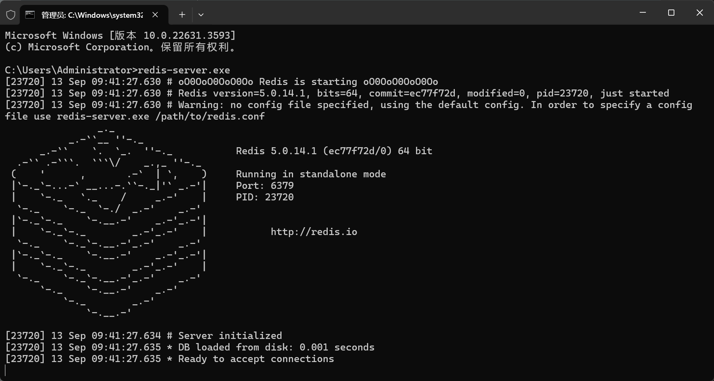
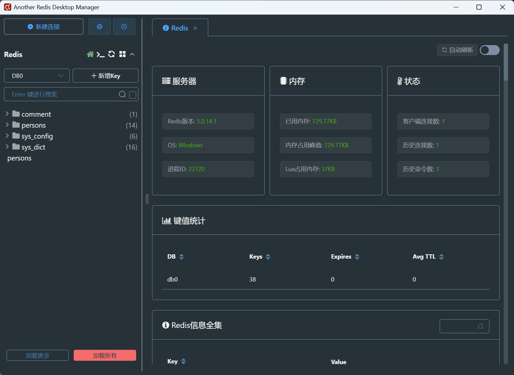

Spring Boot对于关系型数据库和非关系型数据库的访问操作都提供了非常好的整合支持。例如MyBaties、JPA、Redis。

## Spring Boot 数据库访问概述

Spring Boot 默认采用整合Spring Data的方式统一处理数据访问层，通过添加大量自动配置，引入各种数据访问模板`xxxTemplate`以及统一的Repository接口，从而达到简化数据访问层的操作。

::: tip 简单介绍一下Spring Data
Spring Data 是 Spring 框架的一个模板，它提供了一套简洁的编程模型来简化数据库操作。Spring Data 通过抽象化数据访问层，使得开发者可以不用编写大量的样板代码，就能实现对数据库的CRUD（创建、读取、更新、删除）操作。以下是Spring Data 的一些关键特性：

- Repository抽象
- 方法名定义查询
- 查询方法命名约定
- 多种数据库支持
- 集成JPA
- 事务管理
- 分页和排序
- 自定义查询
- 事件发布
- 集成测试支持

Spring Data 的目标是减少数据访问层的样板代码，让开发者能够更专注于业务逻辑的实现，同时保持代码的简洁性和可维护性。
:::

Spring Boot 对 Spring Data 支持的数据库进行了整合管理，提供了多种依赖启动器。以下是常见的：

|                名称                |                       描述                        |
| :------------------------------: | :---------------------------------------------: |
|   spring-boot-starter-data-jpa   |        Spring Data JPA 与 Hibernate 的启动器         |
| spring-boot-starter-data-mongodb |       MongoDB 和 Spring Data MongoDB 的启动器        |
|  spring-boot-starter-data-neo4j  |       Neo4j 图数据库和 Spring Data Neo4j 的启动器        |
|  spring-boot-starter-data-redis  | Redis 键值数据存储与 Spring Data Redis 和 Jedis 客户端的启动器 |

::: important 关于MyBatis依赖
Spring Boot 没有提供MyBatis场景依赖，但MyBatis开发团队提供了适配依赖—— `mybatis-spring-boot-starter`
:::

## Spring Boot 整合 MyBatis

::: tip 简单介绍一下MyBatis
MyBatis 是一个流行的持久层框架，用于简化 Java 应用程序与数据库之间的交互。它提供了 SQL 映射和数据访问对象（DAO）的实现，使得开发者能够以更直观和灵活的方式进行数据库操作。

::: important 什么是"持久层"
在软件开发中，"持久层"（Persistence Layer）是应用程序架构中的一个层次，它负责数据的持久化，即将数据保存到数据库或其他形式的存储系统中，以及从存储系统中检索数据。

- 持久化是指将数据保存到持久存储中，如硬盘或数据库，这样即使在应用程序关闭或系统重启后，数据也不会丢失。

想象一下，你的电脑里有一个电子表格，里面记录了你的购物清单。这个电子表格就像是你的电脑里的一个“数据库”，它帮你记住了所有你想买的东西。

现在，如果你想要在你的电脑上创建一个新的购物清单，或者更新现有的清单，或者查询某个特定商品，你需要打开电子表格，然后手动输入或修改数据。这个过程就像是你在编写代码来操作数据库。

但是，如果你有一个助手，这个助手知道如何操作电子表格，并且可以自动帮你完成这些任务，那么你就不需要亲自动手了。这个助手就像是“持久层框架”。

持久层框架的“持久”部分，意味着它帮助你保存信息，就像你的电子表格保存购物清单一样。即使你关闭了电脑，购物清单的信息也不会消失。
:::

### 基础环境搭建

**1. 准备数据**

通过 MySQL 或者 MySQL 管理工具 Navicat 创建好数据库和数据库表

> [!tip]
> 基础建表语句此处不做阐述，仅讲解步骤。

**2.添加依赖**

在 Spring Boot 项目的 `pom.xml` 文件中添加 MyBatis 和数据库连接池的依赖。

```xml
<dependencies>
    <!-- Spring Boot Starter MyBatis -->
    <dependency>
        <groupId>org.mybatis.spring.boot</groupId>
        <artifactId>mybatis-spring-boot-starter</artifactId>
        <version>版本号</version>
    </dependency>
    <!-- 数据库驱动依赖，例如 MySQL -->
    <dependency>
        <groupId>mysql</groupId>
        <artifactId>mysql-connector-java</artifactId>
    </dependency>
</dependencies>
```

>[!tip]
>MySQL依赖在项目创建时，可以直接选择。

**3. 配置数据源**

在 `application.properties` 或 `application.yml` 文件中配置数据库连接信息。

```properties
# application.properties
spring.datasource.url=jdbc:mysql://localhost:3306/数据库名
spring.datasource.username=用户名
spring.datasource.password=密码
spring.datasource.driver-class-name=com.mysql.cj.jdbc.Driver
```

::: important 关于数据源
数据源，简单来说就是应用程序与数据库之间的桥梁。它负责提供数据库连接，允许应用程序执行查询、更新、插入和删除等操作。在数据库编程中，数据源通常包括以下关键要素：
- 数据库连接信息
- 提供连接池
- 配置参数
- 事务处理

在 Spring Boot 中，默认情况下，如果没有特别指定，它会使用内置的 Tomcat JDBC 连接池。但是，Spring Boot 支持多种数据库连接池，包括 HikariCP、DBCP2、Tomcat JDBC 等，你可以根据需要配置使用不同的连接池。

例如使用阿里巴巴的 Druid 数据源。
- 先在`pom.xml`文件中添加依赖
```xml
<dependency>
	<groupId>com.alibaba</groupId>
	<artifictId>druid-spring-boot-starter</artifictId>
	<version>版本号</version>
</dependency>
```

- 接着在配置文件中添加数据源信息和参数配置
```properties
spring.datasource.url=jdbc:mysql://localhost:3306/数据库名
spring.datasource.username=用户名
spring.datasource.password=密码

#添加第三方数据源Druid配置参数。
spring.datasource.type=com.alibaba.druid.pool.DruidDataSource
spring.datasource.initialSize=20
spring.datasource.minIdle=10
spring.datasource.maxActive=100
```

- 自定义Druid配置类
在config包下创建一个配置类：DataSourceConfig
```java
import com.alibaba.druid.pool.DruidDataSource;
//import ... 略

@Configuration
public class DataSourceConfig {
	@Bean
	@ConfigurationProperties(prefix = "spring.datasource")
	public DataSource getDruid() {
		return new DruidDataSource();
	}
}
```

:::

::: tip 驼峰命名映射
- 为了避免数据库的字段名称与实体类中的映射出现问题，可以开启驼峰命名匹配映射配置

```properties
mybatis.configuration.map-underscore-to-camel-case=true
```
:::

**4.创建实体类**

创建一个domain的包，用于存放实体类。在包中定义与数据库表对应的Java实体类。

示例：

```java
public class User {
    private Integer id;
    private String name;
    private Integer age;
    // getters and setters 以及 toString() 方法
}
```

### 使用注解的方式整合MyBatis

相比 Spring 与 MyBatis 的整合，Spring Boot 与 MyBatis 的整合会使项目开发更加简便，同时支持XML和注解两种配置方式。

根据上述基础环境搭建完成后我们继续：

**5.创建Mapper接口文件**

- 创建Mapper包，定义一个接口类，例如UserMapper

```java
@Mapper
public interface UserMapper {
    @Select("SELECT * FROM user WHERE id = #{id}")
    User findById(Integer id); 

    @Insert("INSERT INTO user(name, age) VALUES (#{name}, #{age})")
    int insertUser(User user); 
}
```

### 使用配置文件的方式整合MyBatis

举例：

- 使用刚刚的User实体类，我们重新创建一个UserMapper（删除原先的数据库语句）

```java
@Mapper
public interface UserMapper {
	public User findById(Integer id);
	public int insertUser(User user);
}
```

- 创建XML映射文件
- 在resources文件夹下创建一个统一管理映射文件的包mapper

```xml
<?xml version="1.0" encoding="UTF-8" ?>  
<!DOCTYPE mapper PUBLIC "-//mybatis.org//DTD Mapper 3.0//EN" "http://mybatis.org/dtd/mybatis-3-mapper.dtd">  
<mapper namespace="com.example.demo.Mapper.UserMapper">  
    <select id="findById" parameterType="int" resultType="com.example.demo.domain.User">  
        select * from user where id = #{id}  
    </select>  
    <insert id="insertUser" parameterType="com.example.demo.domain.User">  
        insert into user(name,age) values(#{name},#{age})  
    </insert>  
</mapper>
```

::: important 关于XML映射文件
- `namespace`：指定对应的Mapper接口的全限定名，MyBatis会根据这个namespace将SQL语句与Mapper接口的方法关联起来。
- 具体SQL语句语法，请查阅MyBatis官方文档。
:::

- 在全局配置文件`application.properties`中配置映射文件路径

```properties
# MyBatis配置XML文件路径
mybatis.mapper-locations=classpath:mapper/*.xml
# 配置XML文件中指定的实体类别名路径
mybatis.type-aliases-package=com.example.demo.domain
```

::: tip 关于实体类别名路径的全局配置
如果XML文件中使用的都是类的全路径名称，则不需要配置此项。
:::

::: important 关于两种整合方式
1. **配置和维护的便捷性**
- **注解**：
    - 优点：注解直接在Java代码中定义，无需额外文件，便于维护和查看。
    - 缺点：对于复杂的SQL语句和映射关系，代码会变得冗长且难以维护。
- **配置文件**：
    - 优点：SQL语句和映射关系分离，使得代码更加清晰，易于维护。
    - 缺点：需要维护额外的XML文件，可能会增加项目复杂度。

2. **灵活性**
- **注解**：
    - 优点：可以直接在方法上定义SQL，方便快速开发和原型设计。
    - 缺点：不适用于复杂的SQL和动态SQL，注解的表达能力有限。
- **配置文件**：
    - 优点：支持复杂的SQL语句，包括动态SQL，提供了更高的灵活性。
    - 缺点：对于简单的SQL，可能显得有些繁琐。

3. **性能**
- 在性能上，注解和配置文件没有本质的区别，因为它们最终都会被解析成相同的SQL语句。性能差异主要取决于SQL语句本身和数据库的优化。

4. **可读性和可维护性**
- **注解**：
    - 由于注解和代码在一起，可能不利于其他开发者理解SQL逻辑。
- **配置文件**：
    - XML配置文件提供了更加清晰的结构，使得SQL逻辑更加易于理解和维护。

5. **适用场景**
- **注解**：
    - 适用于简单或者数量较少的SQL操作。
    - 适用于快速原型开发或小项目。
- **配置文件**：
    - 适用于复杂的SQL操作，尤其是涉及多表联合查询、存储过程等。
    - 适用于大型项目，有利于分工合作和后期维护。
:::

## Spring Boot 整合 JPA

JPA是SUN公司提出的Java持久化规范，为开发者提供了一种对象/关系映射的工具管理Java中的关系型数据，其主要目的是简化现有的持久化开发工作和整合ORM技术。

### Spring Data JPA介绍

- Spring Data JPA 是 Spring 在 ORM 框架、JPA 规范的基础上封装的一套 JPA 应用框架。
- 使开发者可以使用较少的代码实现数据操作，同时易于扩展。

举例：

**1. 编写ORM实体类**

```java
@Entity(name = "user")
public class User (
	@Id
	@GeneratedValue(strategy = GenerationType.IDENTITY)
	private Integer id;
	@Column(name = "name")
	private String name;
	//省略get和set方法
)
```

- @Entity：标注要与数据库做映射的实体类，默认情况，数据表的名称就是首字母小写的类名。也可以使用name属性指定映射的表名。
- @Id：表示对应表中的主键。
- @GeneratedValue：与@Id注解标注在同一位置，用于表示属性对应主键的生成策略，可以省略。
- @Column：标注在属性上，当类属性与表字段名不同时，使用name属性表示对应的表字段名即可。

**2. 编写Repository接口**

- 在Spring Data JPA中，有两种主要的方式来生成SQL查询：

- (1) 基于命名的方法：Spring Data JPA可以根据你在Repository接口中定义的方法名自动生成SQL查询。这种方式不需要编写任何SQL语句，Spring Data JPA会根据方法名的约定来推断出相应的查询。（具体规则请查阅官方）

- 如果你有一个名为`UserRepository`的接口，并定义了一个方法`findByName`，Spring Data JPA会自动生成一个查询来查找`name`字段匹配的记录。

```java
public interface UserRepository extends JpaRepository<User, Integer> {
    User findByName(String name);
}
```

- (2) 使用`@Query`注解：如果你需要执行更复杂的查询，或者基于命名的方法无法满足你的需求，你可以使用`@Query`注解来显式地定义SQL查询。这种方式允许你直接编写JPQL（Java Persistence Query Language）或者原生SQL语句。

```java
public interface UserRepository extends JpaRepository<User, Integer> {
    @Query("SELECT u FROM User u WHERE u.name = ?1")
    User findUserByName(String name);
}
```

- 数据更新或者删除操作的方法上需要使用@Modifying和@Transactional注解
- @Modifying表示支持数据变更
- @Transactional表示支持事务管理。

::: tip 关于自定义的Repository接口
- 在自定义的Repository接口中，针对数据的变更操作（修改、删除），无论是否使用了@Query注解，都必须在方法上添加@Transactional注解进行事务管理，否则程序就会出现`InvaildDataAccessApiUsageException`异常。如果在调用Repository接口方法的业务层Service类上已经添加了@Transactional注解进行事务管理，那么Repository接口文件就可以省略@Transactional注解
- 使用@Query注解方式执行数据变更操作（修改、删除），除了要使用@Query注解，还必须添加@Modifying注解表示数据变更。
:::

### 使用 Spring Boot 整合 JPA

**1. 添加Spring Data JPA依赖**

```pom.xml
<dependency>  
    <groupId>org.springframework.boot</groupId>  
    <artifactId>spring-boot-starter-data-jpa</artifactId>  
</dependency>
```

**2. 编写ORM实体类**

```java
@Entity(name = "user")  
public class User {  
    @Id  
    @GeneratedValue(strategy = GenerationType.IDENTITY)  
    private Integer id;  
    private String name;  
    @Column(name = "age")  
    private Integer age;  
}
```

**3. 编写Repository接口**

```java  
package com.example.demo.Repository;  

import com.example.demo.domain.User;  
import org.springframework.data.jpa.repository.JpaRepository;  
import org.springframework.data.jpa.repository.Modifying;  
import org.springframework.data.jpa.repository.Query;  
  
public interface UserRepository extends JpaRepository<User, Integer> {  
    //采用默认的名称  
    User findByName(String name);  
    User findByNameAndAge(String name, Integer age);  
  
    //根据id删除用户  
    @Modifying
    @Query("update user u set u.name = ?1 where u.id = ?2")  
    int updateName(String name, Integer id);  
  
    //根据用户名删除用户  
    @Modifying
    @Query("delete from user u where u.name = ?1")  
    int deleteByName(String name);  
}
```


## Spring Boot 整合 Redis

除了对关系型数据库的整合支持外，Spring Boot 对非关系型数据库也提供了非常好的支持。

### Redis介绍

Redis 是一个开源（BSD许可）的、内存中的数据结构存储系统，它可以用作数据库、缓存和消息中间件，并提供多种语言API。

> [!tip]
>此处不做安装Redis安装介绍


#### 特点

- 存取速度快
- 支持丰富的数据类型
- 操作具有原子性
- 提供多种功能

#### 基本操作

- 开启Redis服务
```cmd
redis-server.exe
```



- 开启客户端工具

```cmd
redis-cli.exe
```

- 推荐使用Redis客户端可视化管理工具，此处推荐使用 `another redis desktop Manager`



- 具体连接操作不做介绍

### 使用 Spring Boot 整合 Redis

**1. 添加 Spring Data Redis 依赖启动器**

```properties
<dependency>  
    <groupId>org.springframework.boot</groupId>  
    <artifactId>spring-boot-starter-data-redis</artifactId>  
</dependency>
```

**2. 编写实体类**

...待续