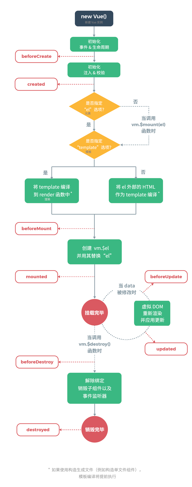

## 参考资料

<NavCard arr='[
    {"title": "vue", "url": "https://cn.vuejs.org/", "desc": "渐进式 JavaScript 框架", "icon": "/navicon/vuepress.png"}
]'></NavCard>

## 什么是Vue？

> [!tip]
> Vue是一套前端框架，免除原生JS中的DOM操作，简化了书写；
> 基于MVVM（Model--View-ViewModel）思想，实现数据的双向绑定，将编程的关注点放在数据上。

> [!important]
> 框架：是一个半成品软件，是一套可重用的、通用的、软件基础代码模型。基于框架进行开发，更加快捷、更加高效。

## 快速入门


MVVM：（Model--View-ViewModel）的缩写，有以下三个单词，具体解释如下：

- Model: 数据模型，特指前端中通过请求从后台获取的数据
- View: 视图，用于展示数据的页面，可以理解成我们的html+css搭建的页面，但是没有数据
- ViewModel: 数据绑定到视图，负责将数据（Model）通过JavaScript的DOM技术，将数据展示到视图（View）上

示例：

```vue
<!DOCTYPE html>
<html>
<head>
    <title>Vue 计数器示例</title>
    <script src="https://cdn.jsdelivr.net/npm/vue@2.6.14/dist/vue.js"></script>
</head>
<body>
    <div id="app">
        <!-- 计数器显示 -->
        <p>计数: {{ count }}</p>
        <!-- 增加按钮 -->
        <button @click="increment">增加</button>
        <!-- 减少按钮 -->
        <button @click="decrement">减少</button>
    </div>

    <script>
        // 创建一个 Vue 实例或“组件”的构造器
        new Vue({
            el: '#app', // 指定 Vue 实例将被挂载到的 DOM 元素
            data: {
                count: 0 // 定义数据对象，Vue 实例的属性
            },
            methods: {
                // 定义方法对象，Vue 实例的方法
                increment: function() {
                    this.count++;
                },
                decrement: function() {
                    this.count--;
                }
            }
        });
    </script>
</body>
</html>
```

> [!tip]
> 插值表达式：`{{表达式}}`。
> - 内容可以是：
> 	- 变量
> 	- 三元运算符
> 	- 函数调用
> 	- 算数运算符

## Vue指令

**指令**：HTML 标签上带有 v- 前缀的特殊属性，不同指令具有不同含义。例如：v-if，v-for… 在vue中，通过大量的指令来实现数据绑定到视图。

常用指令：

| 指令        | 作用                             |
| --------- | ------------------------------ |
| v-bind    | 为HTML标签绑定属性值，如设置 href , css样式等 |
| v-model   | 在表单元素上创建双向数据绑定                 |
| v-on      | 为HTML标签绑定事件                    |
| v-if      | 条件性的渲染某元素，判定为true时渲染,否则不渲染     |
| v-else    |                                |
| v-else-if |                                |
| v-show    | 根据条件展示某元素，区别在于切换的是display属性的值  |
| v-for     | 列表渲染，遍历容器的元素或者对象的属性            |

### v-bind和v-model

- v-bind：为HTML标签绑定属性值，如设置 href , css样式等。当vue对象中的数据模型发生变化时，标签的属性值会随之发生变化。
- v-model：在表单元素上创建双向数据绑定。什么是双向？

	- vue对象的data属性中的数据变化，视图展示会一起变化

	- 视图数据发生变化，vue对象的data属性中的数据也会随着变化。

```vue
<!DOCTYPE html>
<html>
<head>
    <title>Vue v-bind 和 v-model 示例</title>
    <script src="https://cdn.jsdelivr.net/npm/vue@2.6.14/dist/vue.js"></script>
</head>
<body>
    <div id="app">
        <!-- 使用 v-model 绑定 input 元素的 value 到 data 对象的 message 属性 -->
        <input v-model="message" type="text" placeholder="输入一些文本">

        <!-- 显示绑定的数据 -->
        <p>输入的消息: {{ message }}</p>

        <!-- 使用 v-bind 动态绑定 class -->
        <div v-bind:class="{ active: isActive, 'text-danger': hasError }">
            这是一个可激活的区域。
        </div>

        <!-- 使用 v-bind 绑定 style -->
        <div v-bind:style="styleObject">这是一个有样式的区域。</div>
    </div>

    <script>
        new Vue({
            el: '#app',
            data: {
                message: '', // v-model 绑定的输入框的初始值
                isActive: true, // 控制 'active' class 的布尔值
                hasError: false, // 控制 'text-danger' class 的布尔值
                styleObject: {
                    color: 'blue', // 动态绑定的样式
                    fontSize: '14px'
                }
            }
        });
    </script>
</body>
</html>
```

### v-on

- v-on：用来给html标签绑定事件的。

```vue
<!DOCTYPE html>
<html>
<head>
    <title>Vue v-on 示例</title>
    <script src="https://cdn.jsdelivr.net/npm/vue@2.6.14/dist/vue.js"></script>
</head>
<body>
    <div id="app">
        <!-- 监听点击事件 -->
        <button v-on:click="counter += 1">增加</button> 计数: {{ counter }}

        <!-- 监听鼠标移动事件 -->
        <p>鼠标移动到此段落上。</p>
        <p v-on:mousemove="updateCoordinates">坐标: {{ x }}, {{ y }}</p>

        <!-- 阻止默认的表单提交行为 -->
        <form v-on:submit.prevent="onSubmit">
            <input type="text" v-model="formData.username">
            <input type="submit" value="提交">
        </form>

        <!-- 监听键盘的 Enter 键 -->
        <input type="text" v-on:key.enter="submitOnEnter" placeholder="按 Enter 提交">

        <!-- 监听点击事件，使用事件修饰符 .once 来确保事件只触发一次 -->
        <button v-on:click.once="doOnce">点击一次</button>
    </div>

    <script>
        new Vue({
            el: '#app',
            data: {
                counter: 0,
                x: 0,
                y: 0,
                formData: {
                    username: ''
                }
            },
            methods: {
                // 增加计数器
                incrementCounter: function() {
                    this.counter += 1;
                },
                // 更新鼠标坐标
                updateCoordinates: function(event) {
                    this.x = event.clientX;
                    this.y = event.clientY;
                },
                // 表单提交时调用
                onSubmit: function() {
                    alert('提交的用户名是: ' + this.formData.username);
                },
                // 按 Enter 键时调用
                submitOnEnter: function() {
                    alert('按下 Enter 键！');
                },
                // 点击一次后不再触发
                doOnce: function() {
                    alert('这个按钮只能点击一次！');
                    this.$el.querySelector('button').removeEventListener('click', this.doOnce);
                }
            }
        });
    </script>
</body>
</html>
```

### v-if和v-show

- `v-if` 用于根据条件渲染元素。如果条件为真（true），Vue 将确保元素渲染到 DOM 中；如果条件为假（false），元素不会被渲染。

```vue
<!DOCTYPE html>
<html>
<head>
    <title>Vue v-if 示例</title>
    <script src="https://cdn.jsdelivr.net/npm/vue@2.6.14/dist/vue.js"></script>
</head>
<body>
    <div id="app">
        <input type="checkbox" v-model="isVisible">
        <label>显示/隐藏文本</label>

        <p v-if="isVisible">这段文本会根据复选框的选中状态显示或隐藏。</p>

        <button v-if="!isLoading" @click="startLoading">开始加载</button>
        <p v-else>加载中...</p>

        <div v-if="error" class="error">
          发生错误：{{ error }}
        </div>
    </div>

    <script>
        new Vue({
            el: '#app',
            data: {
                isVisible: true,
                isLoading: false,
                error: null
            },
            methods: {
                startLoading: function() {
                    this.isLoading = true;
                    setTimeout(() => {
                        this.isLoading = false;
                        this.error = '加载失败。';
                    }, 2000);
                }
            }
        });
    </script>
</body>
</html>
```

- `v-show` 用于根据条件切换元素的显示状态。与 `v-if` 不同，`v-show` 不涉及 DOM 元素的插入或删除，而是简单地切换元素的 CSS 属性来控制其可见性。

```vue
<!DOCTYPE html>
<html>
<head>
    <title>Vue v-show 示例</title>
    <script src="https://cdn.jsdelivr.net/npm/vue@2.6.14/dist/vue.js"></script>
</head>
<body>
    <div id="app">
        <!-- 使用复选框控制 v-show -->
        <input type="checkbox" v-model="isTextVisible">
        <label>显示/隐藏文本</label>

        <p v-show="isTextVisible">这段文本会根据复选框的选中状态显示或隐藏。</p>

        <!-- 使用按钮切换 v-show -->
        <button @click="toggleText">切换文本显示</button>

        <div v-show="isTextVisible">这个 div 也会根据复选框的选中状态切换显示状态。</div>
    </div>

    <script>
        new Vue({
            el: '#app',
            data: {
                isTextVisible: true
            },
            methods: {
                toggleText: function() {
                    this.isTextVisible = !this.isTextVisible;
                }
            }
        });
    </script>
</body>
</html>
```

### v-for

- v-for：用于基于源数据多次渲染一个元素或组件。它非常适合用来创建列表、表格等需要重复元素的界面。

```vue
<!DOCTYPE html>
<html>
<head>
    <title>Vue v-for 示例</title>
    <script src="https://cdn.jsdelivr.net/npm/vue@2.6.14/dist/vue.js"></script>
</head>
<body>
    <div id="app">
        <!-- 渲染一个数字列表 -->
        <h2>数字列表</h2>
        <ul>
            <li v-for="number in numbers" :key="number">
                {{ number }}
            </li>
        </ul>

        <!-- 渲染一个对象数组 -->
        <h2>用户列表</h2>
        <ul>
            <li v-for="user in users" :key="user.id">
                {{ user.name }} ({{ user.email }})
            </li>
        </ul>
    </div>

    <script>
        new Vue({
            el: '#app',
            data: {
                numbers: [1, 2, 3, 4, 5],
                users: [
                    { id: 1, name: 'Alice', email: 'alice@example.com' },
                    { id: 2, name: 'Bob', email: 'bob@example.com' },
                    { id: 3, name: 'Carol', email: 'carol@example.com' }
                ]
            }
        });
    </script>
</body>
<html>
```

## 生命周期

vue的生命周期：指的是vue对象从创建到销毁的过程。vue的生命周期包含8个阶段：每触发一个生命周期事件，会自动执行一个生命周期方法，这些生命周期方法也被称为钩子方法。其完整的生命周期如下图所示：

| 状态            | 阶段周期 |
| ------------- | ---- |
| beforeCreate  | 创建前  |
| created       | 创建后  |
| beforeMount   | 挂载前  |
| mounted       | 挂载完成 |
| beforeUpdate  | 更新前  |
| updated       | 更新后  |
| beforeDestroy | 销毁前  |
| destroyed     | 销毁后  |



