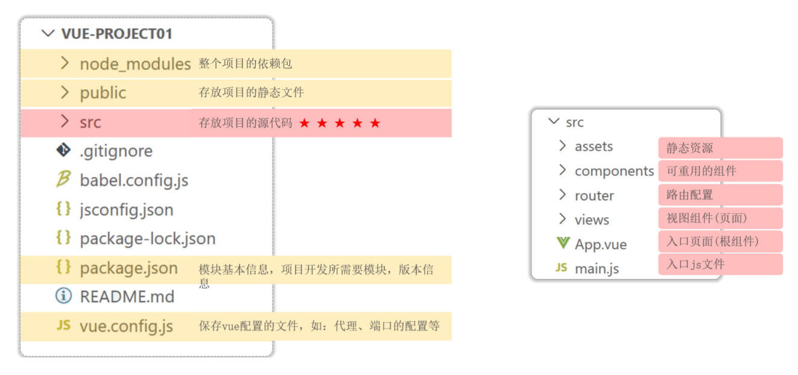
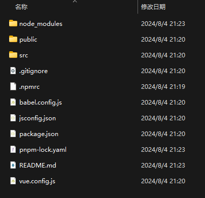
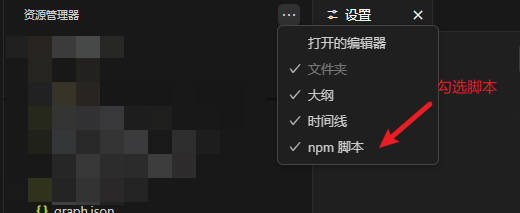
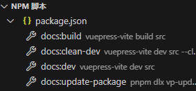
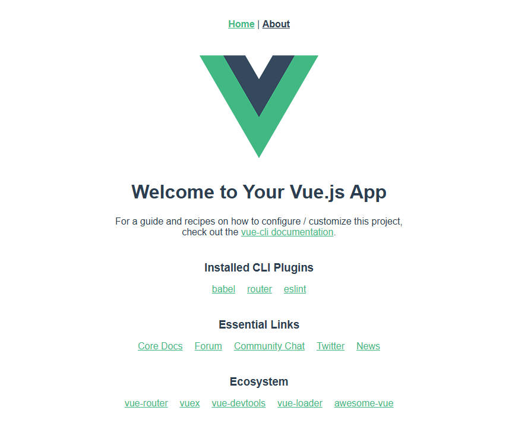

> [!important]
> 现阶段，vite已成为一颗熠熠生辉的新星，未来有成为替代Vue-cli的可能与主流趋势。

## 资料与文档

<NavCard arr='[
    {"title": "Vue-cli文档", "url": "https://cli.vuejs.org/zh/guide/creating-a-project.html", "desc": "🛠️ Vue.js 开发的标准工具", "icon": "/navicon/vuepress.png"}
]'></NavCard>

## 概要

随着前端开发需求向模块化、组件化、规范化以及自动化方向发展，企业级项目特别重视采用工程化方法以提升开发效率和产品质量。一个有效的手段是利用Vue-cli官方提供的脚手架工具，它能快速生成Vue工程模板，并包含统一的项目目录结构、本地程序调试、热部署、单元测试和集成打包上线等功能。

## 什么是前端工程化？

在企业级的前端项目开发中，把前端开发所需要的工具、技术、流程、经验进行规范化和标准化。从而提升开发效率，降低开发难度等等。

### 特点

- 模块化：将js和css等，做成一个个可复用模块 
- 组件化：将UI组件，css样式，js行为封装成一个个的组件，便于管理 
- 规范化：提供一套标准的规范的目录接口和编码规范，所有开发人员遵循这套规范 
- 自动化：项目的构建，测试，部署全部都是自动完成

## 前端工程化入门

### 环境准备

Vue-cli特点：

- 统一的目录结构
- 本地调试
- 热部署：热部署功能使得在项目代码更新后无需手动重启服务器就能实时反映在浏览器中。
- 单元测试
- 集成打包上线

使用vue3-cli 进行快速开发

1. 搭建vue环境

    - 安装Nodejs

    - 全局安装Vue-cli：命令行输入npm install --g vue-cli

2. 创建项目

    - vue create 项目名称

    - 选择手动配置项目特性 Manually select features

    - 空格选择Router、Vuex、Babel、CSS Pre-processors、Linter / Formatter

    - 选择3.x

    - 使用历史模式

    - 使用CSS预处理语言 选择SCSS

    - 使用格式化代码方式 选择ESLint + Prettier(此方式格式化严格)

    - 选择代码规则检测 Lint on save

    - 记录配置选择 保存该次配置为默认配置

    - 使用VScode打开 控制台 npm run serve

> [!tip]
> 也可以使用图形化创建工具
> 命令窗口输入：
> ```cmd
> vue ui
> ```

### 目录结构

一图流简化版：



### 一级目录结构

>[!tip]
>本目录以vue ui创建的默认Vue3基础项目为例，包管理器选择的是默认npm

- node_modules
- public
- src
- .gitignore
- .npmrc
- babel.config.js
- jsconfig.json
- package.json
- pnpm-lock.yaml
- README.md
- vue.config.js



下面是每个文件和文件夹的作用：

1. `node_modules`：这是一个文件夹，其中包含项目所依赖的所有第三方库和模块。这些依赖项是通过`npm`或`pnpm`等包管理器安装的。

> [!tip]
> 一般克隆下来的前端vue项目是不存在node_modules这个文件夹的，因为该文件夹属于忽略项，且内容较大。项目克隆后可以通过`npm install`等包管理器提供的安装命令进行安装。

2. `public`：这个文件夹通常包含静态资源文件，如HTML、CSS、JavaScript等，它们在构建过程中不会被Webpack等打包工具处理。

3. `src`：源代码文件夹，包含项目的主要代码，例如Vue组件、JavaScript逻辑、样式文件等。

4. `.gitignore`：这是一个配置文件，用于告诉Git版本控制系统忽略哪些文件或文件夹。例如，`node_modules`文件夹通常会被添加到这个文件中，以避免将它们上传到Git仓库。

5. `.npmrc`：NPM配置文件，可以设置NPM的配置选项，比如默认的包安装目录等。

6. `babel.config.js`：Babel配置文件，用于定义Babel如何转译JavaScript代码，支持ES6+语法。

7. `jsconfig.json`：用于配置JavaScript项目的设置，比如指定编译器选项、包含的文件等。

8. `package.json`：项目配置文件，列出了项目的依赖项、脚本命令、版本号等信息。它是`npm`或`pnpm`管理依赖和执行脚本的基础。

9. `pnpm-lock.yaml`：这是`pnpm`的锁定文件，记录了项目依赖的确切版本，确保在不同环境之间保持一致性。

10. `README.md`：Markdown格式的说明文件，通常包含项目的介绍、如何安装和使用等信息。

11. `vue.config.js`：Vue CLI的配置文件，用于自定义Vue项目的构建和开发选项。

> [!tip]
> dist目录也是位于一级目录中的，一开始并不存在，一般是项目构建（build）之后创建。

### 二级目录结构

#### node_modules

关于node_modules文件夹中的内容就不做过多的介绍了，此处包含的都是通过包管理器安装过来的一些依赖文件，编写代码时我们也不会碰里面的文件。

- 引入对应的依赖时记得使用包管理器安装命令例如`npm install`

- 包管理器会自动根据package.json中的依赖信息下载对应的依赖到node_modules中
#### public


公有资源的存放路径，一般以存储静态资源为主，包括网站的lfavicon.ico等文件。同时还包括了项目的主入口`index.html`

后续打包构建项目过程中，public中的文件会直接并入dist文件夹中

#### src

src是我们的源代码文件夹，包含：

- assets
- components
- App.vue
- main.js

下面是每个文件和文件夹的作用：

1. `assets`：用于存放项目中的静态资源，如图片、样式表、JavaScript文件等。

2. `components`：用于存放Vue组件。在Vue中，组件是可复用的代码块，可以包含HTML、JavaScript和CSS。

3. `App.vue`：这是Vue应用程序的根组件文件。它定义了整个应用的初始布局和逻辑。

4. `main.js`：这是Vue应用程序的入口文件，用于创建Vue实例并挂载到DOM元素上。它通常会导入Vue、App.vue组件以及其它必要的库或插件。

### 运行Vue项目

- 运行方式1：通过VSCode图形化界面运行。
- 在设置中搜索npm，打开自动检测npm脚本：


- 在项目左上角资源管理器处勾选npm脚本：



- 此时就可以在Vue项目的资源管理器的左下角看到npm脚本了



> [!tip]
> 图形化的界面可以提高我们的开发效率，减少不必要的重复指令输入指令时间。

- 接着点击serve旁边的运行按钮就可以自动执行Vue项目的部署了。

::: warning 注意
Vue 项目运行前记得安装依赖，执行`npm install`等包管理器命令。
:::

- 默认端口在8080



## 简述初始化Vue项目的原理

- 在入口文件main.js中，首先引入了Vue和根组件App.vue
- 然后使用了Vue Router插件
- 接着创建Vue实例，并挂载到DOM中。

- App.vue是应用的根组件，包含模板、脚本和样式三个部分
	- 模板（template）：定义页面结构，包含HTML标签
	- 脚本（script）：定义组件数据、方法和生命周期钩子等
	- 样式（style）：定义组件css样式